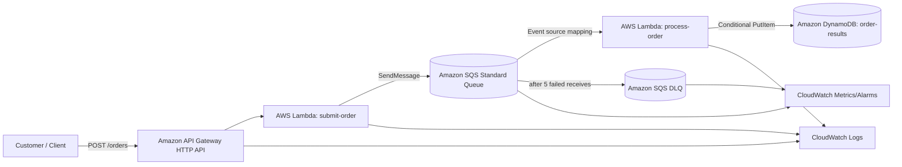

# QuickCart AWS Order Request Queue & Processing System

A small, production-minded serverless AWS project that demonstrates asynchronous order processing, decoupling, buffering, retry behavior, dead-letter isolation, idempotency, monitoring, security, and Terraform-based infrastructure management.

## Architecture



The customer-facing path ends after the producer Lambda successfully places the order in SQS. Processing happens later. Therefore, temporary consumer failure does not cause an accepted order to disappear.

## Why these AWS services

| Requirement | Selected service | Reason |
|---|---|---|
| HTTP order submission | API Gateway HTTP API | Managed endpoint, lower-feature/lower-cost API type than REST API for a simple POST route |
| Producer | Lambda | Validates payload, creates order ID, sends to SQS, returns 202 |
| Durable buffer | SQS Standard | Decouples producer/consumer, handles traffic bursts, at-least-once delivery |
| Async worker | Lambda | Native SQS polling/integration and automatic scaling |
| Retry/DLQ | SQS redrive policy | Failed messages reappear after visibility timeout; poison messages move to DLQ |
| Idempotency/result | DynamoDB | Conditional write prevents duplicate result creation under at-least-once delivery |
| Operations | CloudWatch | Logs, queue metrics, custom failure metric, alarms, dashboard |
| Security | IAM + SSE-SQS | Least-privilege roles and encryption at rest without customer-managed KMS overhead |

## Repository layout

```text
order-request-processing/
├── README.md
├── requirements/
├── architecture/
├── reliability/
├── monitoring/
├── security/
├── cost/
├── src/
│   ├── producer/
│   └── consumer/
├── terraform/
├── tests/
├── scripts/
├── .github/workflows/
└── presentation/
```

## Prerequisites

- AWS account and AWS CLI credentials with permission to create the project resources
- Terraform >= 1.6
- Python 3.12+
- Git
- `curl` for API tests

Choose one AWS Region and keep all resources in that Region. The examples use `eu-central-1` unless overridden.

## Deploy

```bash
git clone <your-repository-url>
cd order-request-processing

cd terraform
cp terraform.tfvars.example terraform.tfvars
terraform init
terraform fmt -recursive
terraform validate
terraform plan
terraform apply
```

Capture the output:

```bash
API_URL=$(terraform output -raw api_url)
echo "$API_URL"
```

## Submit a successful order

```bash
curl -i -X POST "$API_URL/orders" \
  -H 'content-type: application/json' \
  -d '{
    "customerId": "CUST-1001",
    "items": [
      {"sku": "SKU-RED-1", "quantity": 2}
    ]
  }'
```

Expected response: HTTP `202 Accepted` with an `orderId` and `status: ACCEPTED`.

## Submit a controlled failure

```bash
curl -i -X POST "$API_URL/orders" \
  -H 'content-type: application/json' \
  -d '{
    "customerId": "CUST-FAIL",
    "items": [{"sku": "SKU-FAIL", "quantity": 1}],
    "simulateFailure": true
  }'
```

The consumer intentionally fails this order. SQS retries it after the visibility timeout. After the configured receive threshold, SQS moves it to the DLQ.

## Verify processing

```bash
aws dynamodb scan \
  --table-name "$(terraform output -raw results_table_name)" \
  --region "$(terraform output -raw aws_region)"
```

Inspect queue state:

```bash
aws sqs get-queue-attributes \
  --queue-url "$(terraform output -raw queue_url)" \
  --attribute-names ApproximateNumberOfMessages ApproximateNumberOfMessagesNotVisible \
  --region "$(terraform output -raw aws_region)"
```

Inspect DLQ state:

```bash
aws sqs get-queue-attributes \
  --queue-url "$(terraform output -raw dlq_url)" \
  --attribute-names ApproximateNumberOfMessages \
  --region "$(terraform output -raw aws_region)"
```

## Run tests

```bash
python -m pip install -r tests/requirements.txt
pytest -q
```

## Failure semantics

SQS Standard provides at-least-once delivery. A message can therefore be delivered more than once. The consumer uses a DynamoDB conditional write (`attribute_not_exists(order_id)`) so a duplicate delivery does not create a second processed result. The event source mapping enables `ReportBatchItemFailures`, so only failed records in a Lambda batch are retried.

## Scaling controls

The queue absorbs bursts while Lambda scales consumers. This project sets SQS event-source `maximum_concurrency = 10` deliberately so the worker cannot overwhelm a downstream dependency. Increase it only after measuring downstream capacity. SQS Standard is chosen instead of FIFO because the brief does not require strict order sequencing and Standard offers simpler high-throughput burst handling.

## Security model

- Producer role: can send only to the main queue and write only to its own log group.
- Consumer role: can read/delete only from the main queue, write only to the results table, and write only to its own log group.
- SQS queues use SQS-managed server-side encryption.
- DynamoDB is encrypted at rest by default and configured with point-in-time recovery disabled in this cost-conscious lab; enable PITR for production data recovery requirements.
- No long-lived AWS keys are stored in Lambda code or repository.
- The demo endpoint is intentionally unauthenticated. For production, use a JWT authorizer (Cognito/external IdP), IAM authorization, or another identity layer before accepting customer orders.

## Git workflow

Protected long-lived branch: `main`.

Recommended short-lived branches:

- `feature/<ticket>-<description>`
- `fix/<ticket>-<description>`
- `docs/<description>`
- `chore/<description>`

Use pull requests into `main`. Require Terraform formatting/validation and unit tests to pass. Do not commit `terraform.tfstate`, `.terraform/`, credentials, `.env`, or generated Lambda ZIP files.

See [architecture/architecture-decisions.md](architecture/architecture-decisions.md), [terraform/README.md](terraform/README.md), and [CONTRIBUTING.md](CONTRIBUTING.md) for the full implementation and decision rationale.

## Cleanup

```bash
cd terraform
terraform destroy
```

Destroy the lab when finished to avoid unnecessary charges.
