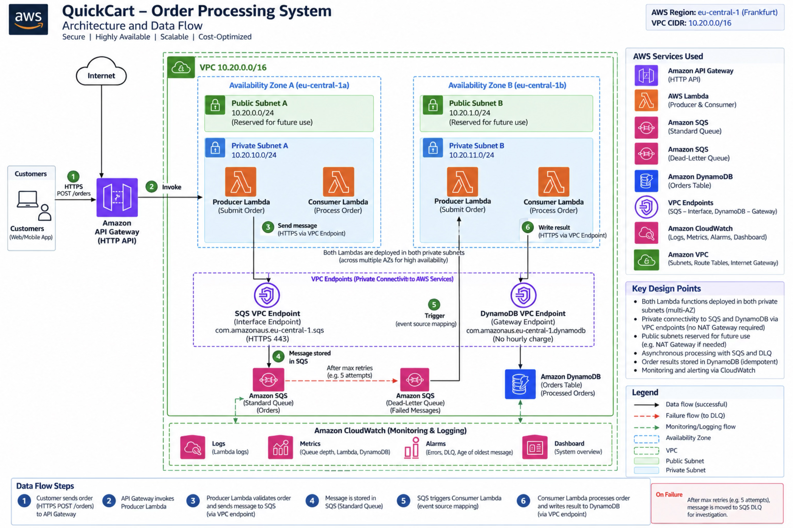

# QuickCart AWS Order Request Queue & Processing System

A four-week AWS architecture and implementation project for a reliable asynchronous order-processing workflow. The repository is structured to match the project plan: design in Week 1, core implementation in Week 2, reliability/monitoring in Week 3, and production-readiness plus the final deployable Terraform solution in Week 4.

## Prototype scope

This is a **working prototype focused on the order-ingestion and asynchronous processing slice** of a wider e-commerce platform. It deliberately demonstrates the architectural principle required by the brief: once an order is accepted into the durable queue, temporary worker unavailability must not lose the customer request.

It does **not** implement payment authorization, inventory reservation, shipping, a full order-management domain model, customer authentication, multi-Region active-active operation, or enterprise CI/CD. Those are described in the Week 4 industry-evolution plan.

## Final architecture

Customer -> API Gateway HTTP API -> Producer Lambda (private subnets) -> SQS Standard Queue -> Consumer Lambda (private subnets) -> DynamoDB

Repeated failures -> SQS Dead-Letter Queue. CloudWatch collects logs/metrics and alarms on queue backlog, age, Lambda errors, application processing failures, and DLQ messages.



### AWS networking

- Region: `eu-central-1` by default (Frankfurt); configurable with Terraform.
- VPC: `10.20.0.0/16`.
- Two Availability Zones selected dynamically from the target Region.
- AZ 1 public subnet: `10.20.0.0/24`.
- AZ 2 public subnet: `10.20.1.0/24`.
- AZ 1 private application subnet: `10.20.10.0/24`.
- AZ 2 private application subnet: `10.20.11.0/24`.
- Internet Gateway attached to the VPC; only public subnet route tables have `0.0.0.0/0` to the IGW.
- No NAT Gateway in the prototype, avoiding fixed NAT cost.
- SQS Interface VPC Endpoint (`com.amazonaws.<region>.sqs`) for private producer access to SQS.
- DynamoDB Gateway VPC Endpoint for private consumer access to DynamoDB.
- Both Lambda functions use the two private subnets and a dedicated security group.
- API Gateway remains an AWS managed regional service outside the VPC and invokes the private Lambda function through the Lambda service; a VPC Link is not required for Lambda integration.

See `week-4-production-readiness/networking/network-design.md` and the diagrams under `week-4-production-readiness/architecture/`.

## Repository layout

```text
order-request-processing/
├── README.md
├── CONTRIBUTING.md
├── .github/workflows/ci.yml
├── week-1-design/
│   ├── requirements/
│   └── architecture/
├── week-2-core-implementation/
│   ├── README.md
│   ├── src/
│   └── terraform/
├── week-3-reliability-monitoring/
│   ├── README.md
│   ├── reliability/
│   ├── monitoring/
│   ├── tests/
│   └── terraform/
└── week-4-production-readiness/
    ├── README.md
    ├── architecture/
    ├── networking/
    ├── security/
    ├── monitoring/
    ├── disaster-recovery/
    ├── industry-evolution/
    ├── cost/
    ├── src/
    ├── tests/
    ├── scripts/
    └── terraform/        # final end-to-end deployable IaC
```

## Prerequisites

### Required workstation tools

1. **Git** 2.40+ (or a current supported version).
2. **Terraform** >= 1.6. The configuration pins AWS provider `~> 6.0` and Archive provider `~> 2.7`.
3. **AWS CLI v2**.
4. **Python 3.12+** and `pip` for the Lambda unit tests and burst-test script.
5. **curl** for API smoke tests.
6. A ZIP utility is useful for inspecting Lambda deployment packages.
7. **Graphviz** is optional if you want to regenerate the repository diagrams from `.dot` source files.

Confirm locally:

```bash
git --version
terraform version
aws --version
python3 --version
curl --version
```

### AWS account prerequisites

- An AWS account where you are permitted to create IAM roles/policies, VPC networking, Lambda, SQS, DynamoDB, API Gateway, CloudWatch resources, and VPC endpoints.
- AWS CLI credentials configured through IAM Identity Center/SSO or another approved short-lived credential mechanism. Avoid committing long-lived access keys.
- An AWS Region with at least two available AZs. Default: `eu-central-1`.
- Sufficient service quotas for Lambda concurrency, Elastic Network Interfaces, VPC endpoints, VPC/subnets, and API Gateway.
- A budget/alert is recommended before deployment. **Interface VPC endpoints are billed per endpoint-hour and data processed**, so this networking-enhanced version is no longer purely Free-Tier-oriented.

Verify identity:

```bash
aws sts get-caller-identity
aws configure get region
```

### Terraform permissions

For a student/lab account, an administrator-style sandbox role is simplest. In a controlled environment, create a dedicated Terraform deployment role with permission only for the resource families in this repository. Terraform itself creates narrower runtime roles for the producer and consumer Lambdas.

## Build and deploy the final solution

```bash
git clone <your-repository-url>
cd order-request-processing/week-4-production-readiness/terraform
cp terraform.tfvars.example terraform.tfvars

terraform init
terraform fmt -recursive
terraform validate
terraform plan -out=tfplan
terraform apply tfplan
```

Get outputs:

```bash
API_URL=$(terraform output -raw api_url)
terraform output network_summary
```

Submit an order:

```bash
curl -i -X POST "$API_URL/orders" \
  -H 'content-type: application/json' \
  -d '{"customerId":"CUST-1001","items":[{"sku":"SKU-RED-1","quantity":2}]}'
```

Expected result: `202 Accepted`. The API acceptance boundary is reached only after the producer successfully sends the order to SQS.

Verify the processed record:

```bash
aws dynamodb scan \
  --table-name "$(terraform output -raw results_table_name)" \
  --region "$(terraform output -raw aws_region)"
```

## Reliability test

Submit a controlled failure:

```bash
curl -i -X POST "$API_URL/orders" \
  -H 'content-type: application/json' \
  -d '{"customerId":"CUST-FAIL","items":[{"sku":"SKU-FAIL","quantity":1}],"simulateFailure":true}'
```

The message is retried and, after `maxReceiveCount = 5`, is isolated in the DLQ.

## Unit tests

```bash
cd order-request-processing
python3 -m pip install -r week-4-production-readiness/tests/requirements.txt
pytest -q week-4-production-readiness/tests
```

## Git workflow

`main` is the only permanent branch. Use short-lived branches and pull requests:

- `feature/QC-101-networking`
- `feature/QC-102-order-api`
- `feature/QC-103-dlq-monitoring`
- `fix/QC-104-idempotency`
- `docs/network-dr-update`
- `chore/provider-upgrade`

Recommended protections on `main`: require pull request review, require CI checks, disallow force-pushes, require branch to be current before merge, and optionally require signed commits in a production organization.

## Explore by week

- **Week 1:** requirements, assumptions, synchronous-vs-asynchronous analysis, architecture options and initial diagrams.
- **Week 2:** producer/queue/consumer implementation and core Terraform concepts.
- **Week 3:** retries, partial-batch handling, DLQ, observability, failure tests.
- **Week 4:** VPC design, least privilege, final Terraform, DR, cost, industry hardening, and final architecture.

## Cleanup

```bash
cd week-4-production-readiness/terraform
terraform destroy
```

Destroy the lab when finished. SQS interface endpoints have an hourly cost even when no orders are being processed.
